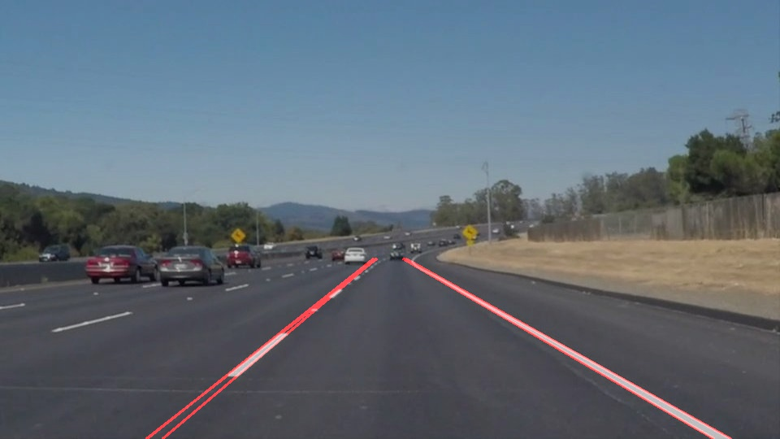
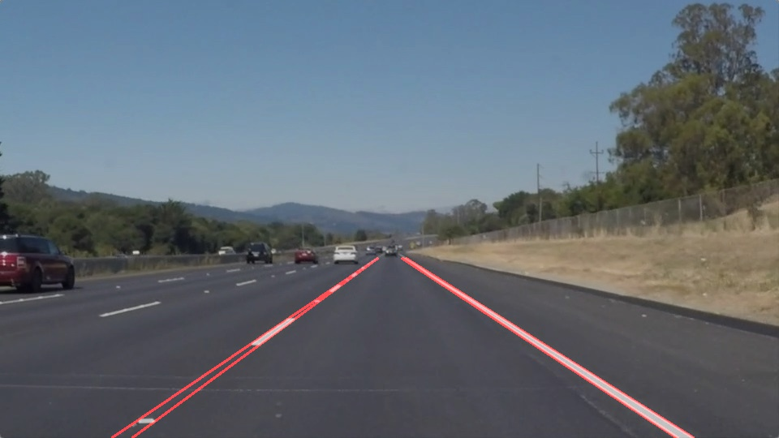
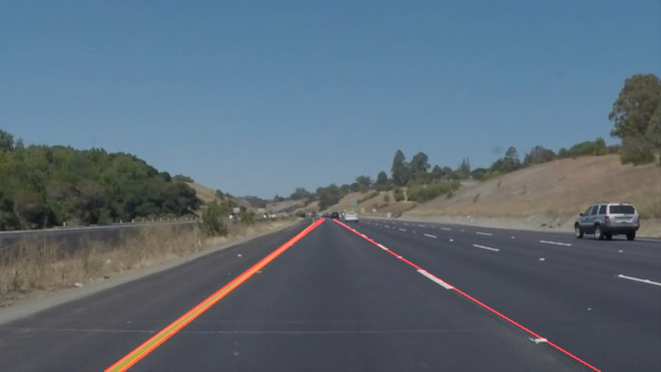
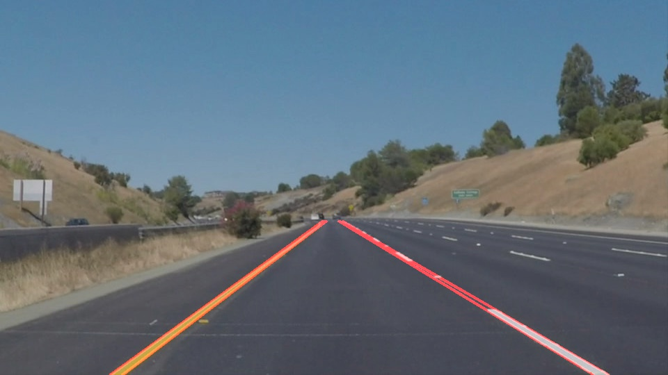
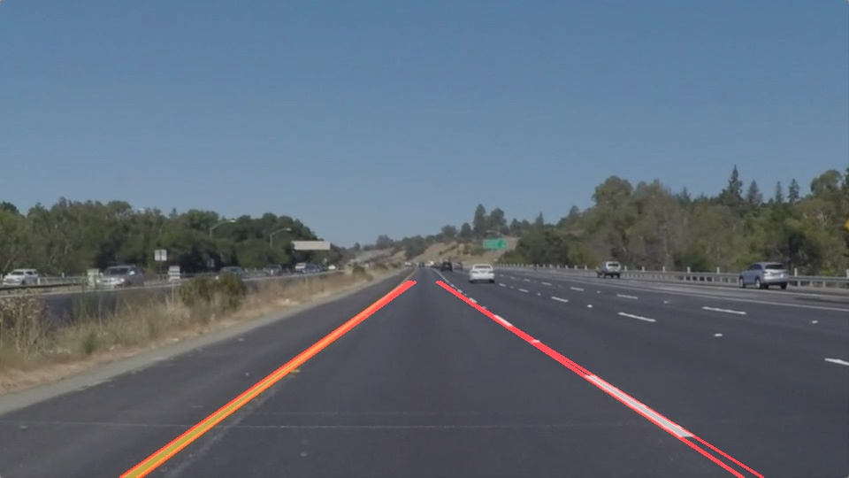
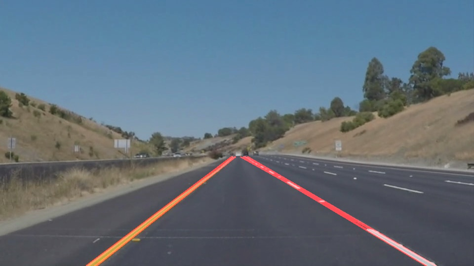

# **Finding Lane Lines on the Road**

The goals / steps of this project are the following:
* Make a pipeline that finds lane lines on the road
* Reflect on your work in a written report

### Reflection

### 1. Describe your pipeline. As part of the description, explain how you modified the draw_lines() function.

My pipeline consisted of the following 5 steps.

1. Convert the image from RGB color space to grayscale;
2. Detect edges on the Gaussian smoothed image using my own auto canny operator;
3. Extract ROI using combined region mask & color space mask;
4. Detect and draw lanes with Hough transform and extrapolation;
5. Draw the detected lanes on the original frame.

I determine the color space mask needed for yellow & white lanes segmentation as follows:

1. Calculate the RGB color space histogram to get the (color, count) pairs;
2. Filter out all colors whose count is zero;
3. Run KMeans clustering algorithm on histograms attained from pictures containing yellow lanes;
4. Set the lower and upper bounds needed for cv2.inRange() as follows:
```
color_filters = {}
for id, mean in enumerate(clf.cluster_centers_):
  std = X[color_id == id].std()
  lower = np.vstack(
    (
      np.array([  0] * 3),
      np.round(mean - 1.5*std).astype(np.int)
    )
  ).max(axis = 0)
  upper = np.vstack(
    (
      np.array([255] * 3),
      np.round(mean + 1.5*std).astype(np.int)            
    )
  ).min(axis = 0)
  color_filters[id] = (
    lower,
    upper
  )
```

In order to draw a single line on the left and right lanes, I modified the draw_lines() function by:

1. Fit a line using the two line endpoints given by probabilistic Hough transform;
```
m, b = np.polyfit(
  (y1, y2),
  (x1, x2),
  1
)
```
2. Use the lower and upper bounds of y-coordinate to calculate those of x-coordinate
```
cv2.line(
    img,
    # Extrapolated x coordinates:
    (int(m*ROI_y_lower + b), ROI_y_lower),
    (int(m*ROI_y_upper + b), ROI_y_upper),
    color,
    thickness
)
```

The detected lanes in test images are shown below:

1. Solid White Curve



2. Solid White Right



3. Solid Yellow Curve



4. Solid Yellow Curve2



5. Solid Yellow Left



6. White Car Lane Switch



### 2. Identify potential shortcomings with your current pipeline

I identified the following shortcomings during my debug process:

1. The params of color space mask are hard-coded.
This makes it not robust to lighting condition changes and leads to the failure
of detector at the end of challenge video.

2. My detector cannot cope with lanes having large curvature at its end.
This might cause severe lag when it is used for controller input and impair the system's
performance.

### 3. Suggest possible improvements to your pipeline

Some possible improvements would be to:

1. Gather more data to improve the params estimation for algorithms like color filtering,
probabilistic Hough transform, etc;

2. Use stronger detector for lane detection like R-CNN & Yolo.
